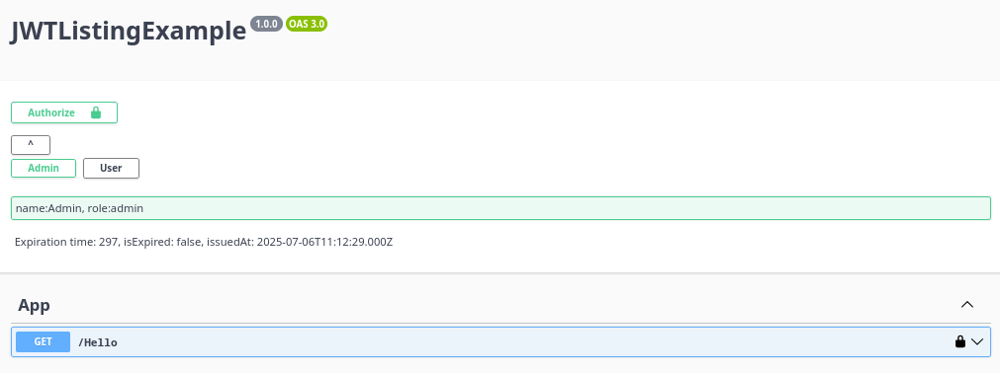

# Description
Plugin for swaggerUI to signIn using different preconfigured JWT.
This plugin allows to change the JWT for the swaggerUI interface on the fly. 
Allowing easy testing endpoints of the endpoints of your app as various users/roles/options.

Of course, use it only on testing environments.

# How to use:
1. Add the plugin to the plugins array of swaggerUI
2. Add a extension to swagger with the name: `x-custom-tokens that contains a list of the JWT that you want to use for your tests
    1. Create a list of JWT that all of them have a property `name` in it. So the plugin can list the JWT's as buttons.
    2. Pass this list with the extension `x-custom-tokens`to swagger

